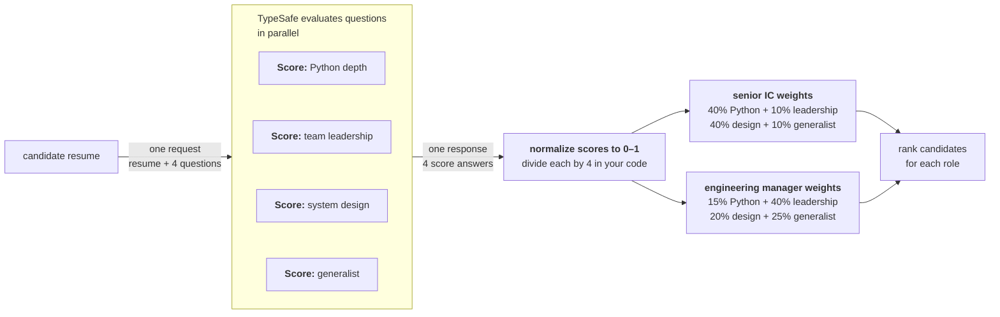

> ## Documentation Index
> Fetch the complete documentation index at: https://docs.typesafe.ai/llms.txt
> Use this file to discover all available pages before exploring further.

# Composite scoring

> Break a complex judgment into atomic scores, combine with weights you control in code.


Oftentimes we want to rank a set of items based on several criteria at once. Composite scoring is an easy way to think about this: break the judgment into independent dimensions, score each one separately, and combine them with weights you control in code.

## Example: resume screening

Let's imagine you are processing resumes for engineering roles. You want to rank the candidates based on several criteria, and ultimately select the top X candidates for further review.



### Step 1: score each dimension independently

**questions:**
```json
{
  "python_depth": {
    "type": "score",
    "instructions": "How much depth of python experience does this candidate have, based on the supplied resume?",
    "criteria": [
      "No Python experience mentioned",
      "Mentioned but no detail",
      "Used in projects, some specifics",
      "Primary language, multiple projects",
      "Deep expertise: architecture, performance, libraries"
    ]
  },
  "team_leadership": {
    "type": "score",
    "instructions": "How much experience does this candidate have managing or leading engineering teams?",
    "criteria": [
      "No management experience mentioned",
      "Informal mentorship or tech lead role",
      "Led a small team or project",
      "Managed a team with direct reports",
      "Managed multiple teams or an engineering org"
    ]
  },
  "system_design": {
    "type": "score",
    "instructions": "How much experience does this candidate have designing large-scale or distributed systems?",
    "criteria": [
      "No architecture work mentioned",
      "Contributed to design discussions",
      "Designed components of a larger system",
      "Owned architecture of a significant system",
      "Designed systems at scale across multiple domains"
    ]
  },
  "generalist": {
    "type": "score",
    "instructions": "How much evidence is there that this candidate picks up unfamiliar tools, roles, or domains outside their core specialty?",
    "criteria": [
      "Only one domain or role mentioned",
      "Some variety but within a narrow field",
      "Worked across a few different areas or tech stacks",
      "Regularly moved between domains, wore many hats",
      "Track record of ramping up in unfamiliar areas and delivering"
    ]
  }
}
```

### Step 2: combine with weights

Each dimension is normalized to 0–1 and weighted. The weights give you an easy way to adjust the relative importance of each dimension, without losing any of the nuance of the individual scores.

**scoring.py:**
```python
py      = response.answers["python_depth"].score / 4
lead    = response.answers["team_leadership"].score / 4
arch    = response.answers["system_design"].score / 4
general = response.answers["generalist"].score / 4

# Senior IC
ic_score = (0.40 * py) + (0.10 * lead) + (0.40 * arch) + (0.10 * general)

# Engineering Manager
em_score = (0.15 * py) + (0.40 * lead) + (0.20 * arch) + (0.25 * general)
```

This gives you the ability to rank the candidates based on the composite score. But more importantly, it gives you visibility into how exactly the final score is being calculated. If the highest ranking candidates are not matching your expectations, you can adjust the weights to find the right balance.
