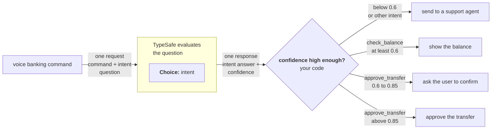

> ## Documentation Index
> Fetch the complete documentation index at: https://docs.typesafe.ai/llms.txt
> Use this file to discover all available pages before exploring further.

# Confidence-gated routing

> Use confidence as a second axis. The answer tells you what; confidence tells you whether to act.


One of TypeSafe's most powerful features is [confidence](../confidence.md). By being intentional with the way you gate decisions on confidence, you can build systems that are both reliable and safe.

## Example: voice banking commands

Let's imagine you are building a voice banking interface to allow the user to interact with their account verbally. While you always want to have reasonable confidence in interpreting the user's intent, some actions are riskier than others and thus demand a higher confidence threshold.



### Step 1: determine the user's intent

**questions:**
```json
{
  "intent": {
    "type": "choice",
    "instructions": "What action is the user requesting?",
    "criteria": {
      "check_balance": "Check the balance of an account",
      "approve_transfer": "Approve the pending transfer request",
      "other": "Something else"
    }
  }
}
```

### Step 2: confidence-gated routing

```python
action = response.answers["intent"]

# Below 0.6 confidence on any action, route to a human
if action.confidence < 0.6:
    route_to_support_agent(account_id)

elif action.choice == "check_balance":
    # Low stakes. 0.6 confidence is sufficient.
    show_balance(account_id)

elif action.choice == "approve_transfer":
    if action.confidence > 0.85:
        # High stakes, but high confidence. Safe to act automatically.
        approve_transfer(account_id)
    else:
        # High stakes, moderate confidence. Verify intent first.
        ask_user_to_confirm("Just to confirm: you would like to approve this transfer, is that correct?")

else:
    route_to_support_agent(account_id)
```

The 0.6 floor catches anything the model is genuinely uncertain about. Above that floor, each action type has its own threshold based on the consequences of acting on a wrong classification. Checking a balance at 0.6 is fine because the worst case is the user having to listen to the balance read-out. But approving a transfer requires very high confidence (>0.85), otherwise the system should ask the user to confirm.

See [Confidence](../confidence.md) for more details on how to think about confidence in your systems.
