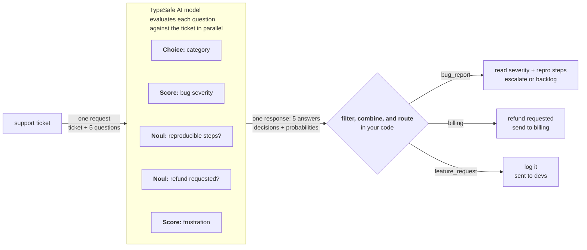

> ## Documentation Index
> Fetch the complete documentation index at: https://docs.typesafe.ai/llms.txt
> Use this file to discover all available pages before exploring further.

# Speculative fan-out

> Send many questions in a single call, including speculative ones, and let your code decide what's relevant.


Because TypeSafe supports sending many questions in a single API call, we recommend putting all of the questions your system needs in a single request, and then using code to decide what is relevant after the fact. All questions are evaluated in parallel, so adding more questions usually has little effect on response time.

## Example: support ticket triage

Let's imagine you are building a support system that needs to triage support tickets. You need to classify the ticket into a category. If it's a bug report, you also need to determine the severity of the bug.

Instead of asking for the category first and then the severity in a follow-up call, you can ask for both at the same time. If the ticket is not a bug report, you simply ignore the results of the bug severity question.



### Step 1: speculative fan-out

**questions:**
```json
{
  "category": {
    "type": "choice",
    "instructions": "Determine the broad category of this support ticket",
    "criteria": {
      "bug_report": "The user is reporting something that is broken or producing errors",
      "billing": "Charges, invoices, refunds, subscriptions",
      "feature_request": "The user is requesting new functionality",
      "account": "Login, permissions, profile, security"
    }
  },
  "bug_severity": {
    "type": "score",
    "instructions": "How severe is the reported issue",
    "criteria": [
      "Cosmetic; no impact to functionality",
      "Broken or degraded feature; workaround exists",
      "Blocking issue; no workaround exists"
    ]
  },
  "has_reproducible_steps": {
    "type": "noul",
    "instructions": "The user describes specific steps to reproduce the issue"
  },
  "refund_requested": {
    "type": "noul",
    "instructions": "The user is explicitly asking for a refund or credit"
  },
  "frustration": {
    "type": "score",
    "instructions": "How frustrated the user appears",
    "criteria": [
      "Calm, matter-of-fact",
      "Frustrated but civil",
      "Very angry"
    ]
  }
}
```

> [!NOTE]
> **Speculative questions:** `bug_severity` and `has_reproducible_steps` only matter if the ticket is a bug report. `refund_requested` only matters for billing. We include all upfront because additional questions usually have little effect on response time. If the ticket turns out to be a feature request, the bug severity result will be irrelevant, in which case your code path simply ignores it.

### Step 2: route with code

Your code decides what is relevant based on the classification result:

**triage.py:**
```python
category = response.answers["category"]
bug_severity = response.answers["bug_severity"]
bug_repro = response.answers["has_reproducible_steps"]
refund = response.answers["refund_requested"]
frustration = response.answers["frustration"]

if category.choice == "bug_report":
    if bug_severity.score > 1.5 and bug_repro.noul > 0.6:
        escalate_to_engineering(ticket_id, severity="high")
    else:
        add_to_bug_backlog(ticket_id)

elif category.choice == "billing":
    if refund.noul > 0.7:
        route_to_billing_with_flag(ticket_id, refund_likely=True)
    else:
        route_to_billing(ticket_id)

elif category.choice == "feature_request":
    log_feature_request(ticket_id)

# Frustration is useful regardless of category
if frustration.score > 1.5:
    flag_for_priority_response(ticket_id)
```

Everything needed for the full decision tree comes from one call. Speculative questions are ignored when irrelevant and save a round trip when they are not.
