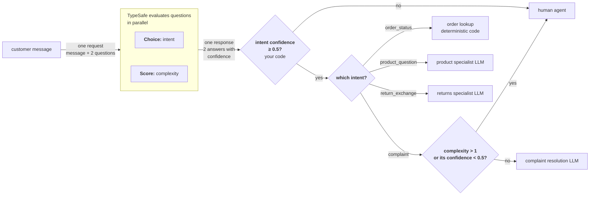

> ## Documentation Index
> Fetch the complete documentation index at: https://docs.typesafe.ai/llms.txt
> Use this file to discover all available pages before exploring further.

# Intent routing

> Classify incoming requests and route each to the optimal handler: deterministic logic, a specialist LLM, or a human.


Not every user request needs the same kind of handler. Some can be answered with a database lookup. Some need an LLM with domain-specific context. Some need a human. TypeSafe can sit in front of all of these as a fast, cheap classifier that determines which handler to invoke.

## Example: customer service routing

Let's imagine you are building a customer service system. Messages come in and need to be routed to the right handler. Rather than sending every message through an expensive LLM to figure out what kind of request it is, you classify first and route accordingly.



### Step 1: classify intent and complexity

**questions:**
```json
{
  "intent": {
    "type": "choice",
    "instructions": "The primary intent of this customer message",
    "criteria": {
      "order_status": "Asking about an existing order",
      "product_question": "Asking about a product before buying",
      "return_exchange": "Wants to return or exchange something",
      "complaint": "Unhappy with experience, wants resolution"
    }
  },
  "complexity": {
    "type": "score",
    "instructions": "How complex is this request to resolve",
    "criteria": [
      "Simple lookup or standard procedure",
      "Requires some judgment or multi-step process",
      "Unusual situation, edge case, or escalation needed"
    ]
  }
}
```

### Step 2: route to the optimal handler

**routing.py:**
```python
def route_ticket(ticket_id, response):
    intent = response.answers["intent"]
    complexity = response.answers["complexity"]

    if intent.confidence < 0.5:
        # If we don't have enough confidence to classify, route to a human agent
        return route_to_human_agent(ticket_id)

    if intent.choice == "order_status":
        handle_order_status(ticket_id)

    elif intent.choice == "product_question":
        handle_with_llm(ticket_id, PRODUCT_SPECIALIST)

    elif intent.choice == "return_exchange":
        handle_with_llm(ticket_id, RETURNS_SPECIALIST)

    elif intent.choice == "complaint":
        low_confidence = complexity.confidence < 0.5
        # A higher complexity.score leans toward the "escalation needed" end of the scale.
        if complexity.score > 1 or low_confidence:
            # Too complex for safe automation, or we're not sure about the complexity; route to a human.
            route_to_human_agent(ticket_id)
        else:
            handle_with_llm(ticket_id, COMPLAINT_RESOLUTION)
```

One intent routes to deterministic code with no LLM involved. Two route to different specialist LLMs, each loaded with different context. One uses the complexity score to decide between an LLM and a human. TypeSafe handles the classification all in a single quick call; the expensive resources only get invoked for the requests that actually need them.

Note the additional confidence check on the complexity score. As discussed in [Confidence](../confidence.md), it is always important to consider the meaning of a low confidence score in the context of the system and the stakes of the decision.
